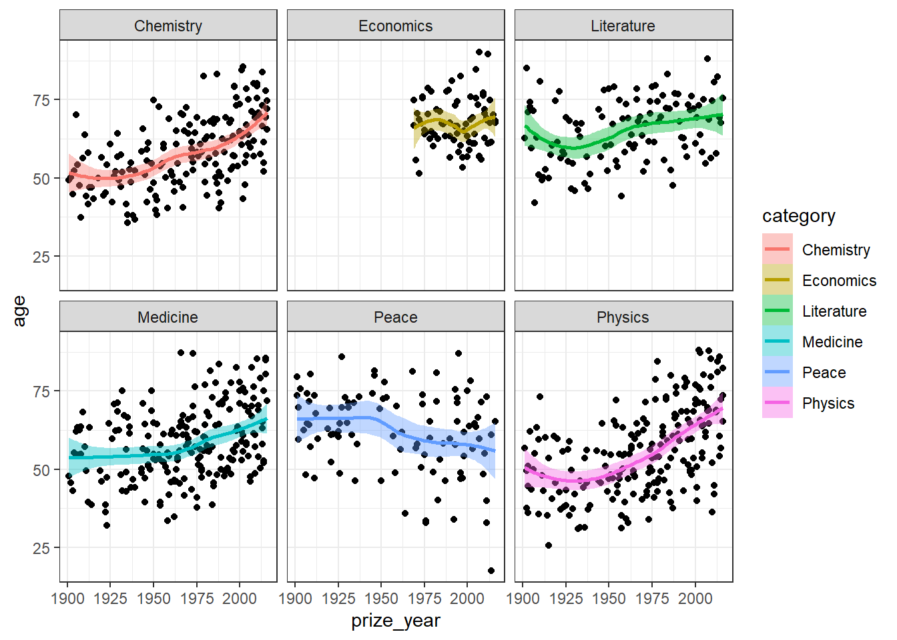

# Strings, fatores e datas {-}

Neste bloco vamos trabalhar com tipos de elementos que em bancos de dados. Aprender a manipular `strings` (palavras), `factors` e `dates` vai nos dar um poder de análise diversificado e útil.

## Strings {-}

A verdade é que nem sempre nosso banco de dados está bem formatado. Por diversos motivos, os dados chegam com uma formatação muito distante do ideal e não é raro termos de limpar os dados antes de iniciar uma análise. Variável que trazem caracteres são as que mais precisam de atenção e limpeza.

O R tem suporte à *regular expression* ou *regex*, uma forma muito utilizada em linguagens de programação para identificar padrões de caracteres através de uma sintaxe própria. Vamos ver alguns exemplos de como utilizá-la.

As funções que iremos trabalhar estão disponíveis no pacote `stringr`, que faz parte do `tidyverse`. Como exemplo vamos utilizar um objeto interno (vetor) com nomes de frutas.


```r
fruit
```

O primeiro passo é detectar padrões dentro do vetor de caracteres. Podemos usar esse vetor lógico para filtrar os elementos que queremos.


```r
str_detect(fruit, pattern = "fruit")

fruit[str_detect(fruit, pattern = "fruit")]


tem_fruit <- str_subset(fruit, pattern = "fruit")
```

Podemos retirar uma parte fixa das palavras através da posição de cada caractere.


```r
str_sub(fruit, 1, 5)
```
Também podemos concatenar e colapsar palavras utilizando diferentes padrões.


```r
tem_berry <- str_subset(fruit, "berry") %>% sample(8)

str_c(tem_fruit, tem_berry, sep = " & ")

str_c(tem_fruit, tem_berry, sep = " + ", collapse = "; ")
```

Em muitos casos precisamos substituir determinada cadeia de caractere. Vamos ver alguns exemplos.


```r
str_replace(tem_berry, pattern = "berry", replacement = "beRRy")

melons <- str_subset(fruit, pattern = "melon")
melons[2] <- NA
melons

str_replace_na(melons, "Não sei")
```

Agora vamos mudar para outra base de dados. O pacote `gapminder` disponibiliza dados de expectativa de vida, população e renda per capta dos países ao longo dos anos. Utilizaremos para testar os marcadores de `Regex`. 

Em `Regex`, utilizamos os marcadores `^` e `$` para indicar os primeiros ou últimos caractere de uma `string`, respectivamente. Portanto, se quisermos filtrar os países que terminam com a sequencia de caracteres, podemos fazer da seguinte forma.


```r
library(gapminder)

paises <- levels(gapminder$country)
paises
```


```r
str_subset(paises, pattern = "land$")

str_subset(paises, pattern = "^Ma")
```

Aumentando um pouco a complexidade da busca, vamos usar o marcador `[` para indicar um grupo de possibilidade. Quais países terminam com as letras: nia, lia, sia?


```r
str_subset(paises, pattern = "[nls]ia$")
```

O R possui alguns grupos pre formatados para facilitar a correspondência, como: [:blank:], [:upper:], [:lower:], [:alpha:], [:digit:], [:alnum:], [:punct:]


```r
str_subset(paises, "[:punct:]")

str_subset(paises, "[:blank:]")
```

Agora vamos ver como extrais padrões entre determinados identificadores dentro de uma cadeia de caractere. Em `Regex` o `.` significa 'qualquer coisa', o `*` significa 'um ou mais em diante'. Utilizaremos esses marcadores para extrair países que tenham uma cadeia de caractere que começa com a letra `m`, em seguida possa ter qualquer letra ou ponto, e termine com a letra `a`.


```r
str_subset(paises, "a.*e")
```

Dando um exemplo mais avançado, vamos filtrar os países que possuem `,` no nome e em seguida retirar todos caracteres após a vírgula.


```r
str_subset(paises, ",")

str_subset(paises, ",") %>% 
  str_remove(",.*")
```


## Fatores {-}

Já falamos um pouco sobre os fatores anteriormente e agora vamos tentar usar eles como recurso para criação de gráficos. 


```r
class(gapminder$continent)

str(gapminder$continent)

nlevels(gapminder$continent)

levels(gapminder$continent)
```

A grande dica é: só convertam caracteres em fatores quando necessário e fiquem sempre de olho se uma variável é ou não um fator. De maneira geral, variáveis como fatores podem dar dor de cabeça em alguns passos durante a análise e recomendável que se utilize sempre caracteres em variáveis qualitativas. Aqui vai um primeiro problema. Mesmo se você filtrar um elemento, os níveis do fator ainda fica lá no objeto. 


```r
nlevels(gapminder$country)

aux_sulamerica <- c("Argentina", "Bolivia", "Brazil", "Chile", "Colombia", "Ecuador", "Paraguay", "Peru", "Uruguay", "Venezuela")
   
sulamerica <- gapminder %>%
  filter(country %in% aux_sulamerica)

nlevels(sulamerica$country)
```

No momento de plotar um gráfico, o `ggplot2` converte internamente todas as variáveis do tipo caractere como fator. Se já for um fator, ele deixa como está.
Ele faz isso por conta da ordem que os elementos aparecem no gráfico. Por exemplo um eixo de nomes ou os níveis da legenda. No exemplo abaixo o `ggplot2` seque a ordem dos níveis do fator da variável `country`, que por sua vez é alfabética. Mas se alterarmos a ordem dos níveis do fator utilizando a função `fct_reorder`, podemos ter um eixo ordenado em função da `lifeExp`.


```r
gap_asia_2007 <- gapminder %>% filter(year == 2007, continent == "Asia")

ggplot(gap_asia_2007, aes(x = lifeExp, y = country)) + geom_point()

ggplot(gap_asia_2007, aes(x = lifeExp, y = fct_reorder(country, lifeExp))) +
  geom_point()
```


```r
gap_1992 <- gapminder %>% 
  filter(year == 1992 ) %>% 
  group_by(continent) %>% 
  summarise(lifeExp = mean(lifeExp))

gap_1992 %>% 
  ggplot(aes(continent, lifeExp, fill = continent)) +
    geom_col()

gap_1992 %>% 
  mutate(continent = fct_relevel(continent, "Oceania", "Asia")) %>% 
  ggplot(aes(continent, lifeExp, fill = continent)) +
    geom_col()

gap_1992 %>% 
  mutate(continent = fct_recode(continent, "Oceania 2" =  "Oceania")) %>% 
  ggplot(aes(continent, lifeExp, fill = continent)) +
    geom_col()

gap_1992 %>% 
  mutate(continent = fct_reorder(continent, -lifeExp)) %>% 
  ggplot(aes(continent, lifeExp, fill = continent)) +
    geom_col()
```

## Datas {-}

Neste bloco vamos trabalhar com a classe de objeto do tipo data. Dentro do `tidyverse`, o pacote que reúne as funções relacionadas a datas é o `lubridate`. É importante mencionar que no é temos os tipos `date` e `date-time` ou `POSIXct`. A diferença entre esses dois tipos é a resolução, sendo que a classe `date-time` armazena além da data, a informação de hora-minuto-segundo. Começando pelo começo, vamos criar objetos do tipo `date` e `date-time`.


```r
library(tidyverse)
library(lubridate)

hoje <- today()

hoje

class(hoje)

str(hoje)

agora <- now()

agora

class(agora)

str(agora)
```

Note que o R utiliza o padrão ISO para mostrar as datas (yyyy-mm-dd). Quando a informação está armazenada nesse padrão, é comum os importadores reconhecerem a variável como data e fazer a conversão adequada. Mas se isso não acontecer, teremos que converter na mão utilizando as funções auxiliares do `lubridate`.

```r
ymd("20190408")

mdy("01-15-2013")

dmy("07/09/2010")
```

Existem várias funções interessantes no pacote e elas são extremamente úteis no dia a dia. Podemos arredondar datas para várias unidades de referencia e computar o dia do ano, mês ou semana. Para fazer operações aritméticas com datas temos que entender o conceito importante de `period` e `duration`, onde o primeiro considera sempre um ano com 365 dias e o segundo é sensível a anos bissexto.


```r
inicio <- ymd("20000223")
fim <- ymd("20161207")

floor_date(inicio, "month")
ceiling_date(inicio, "week")

yday(fim)
mday(fim)

inicio + years(3) 
inicio + dyears(3) 
inicio - months(36)

```

Para calcular o intervalo entre duas datas e converter isso em diversas unidades, também é fácil.


```r
fim - inicio 

time_length(fim - inicio, "year")
time_length(fim - inicio, "month")
time_length(fim - inicio, "week")

```


## Exercícios {-}

(@) **Importe o arquivo `nobel_winners.csv` e use a função `glimpse()` para ver a estrutura da base.**


```
#> Observations: 969
#> Variables: 18
#> $ prize_year           <dbl> 1901, 1901, 1901, 1901, 1901, 1901, 1902,...
#> $ category             <chr> "Chemistry", "Literature", "Medicine", "P...
#> $ prize                <chr> "The Nobel Prize in Chemistry 1901", "The...
#> $ motivation           <chr> "\"in recognition of the extraordinary se...
#> $ prize_share          <chr> "1/1", "1/1", "1/1", "1/2", "1/2", "1/1",...
#> $ laureate_id          <dbl> 160, 569, 293, 462, 463, 1, 161, 571, 294...
#> $ laureate_type        <chr> "Individual", "Individual", "Individual",...
#> $ full_name            <chr> "Jacobus Henricus van 't Hoff", "Sully Pr...
#> $ birth_date           <date> 1852-08-30, 1839-03-16, 1854-03-15, 1828...
#> $ birth_city           <chr> "Rotterdam", "Paris", "Hansdorf (Lawice)"...
#> $ birth_country        <chr> "Netherlands", "France", "Prussia (Poland...
#> $ gender               <chr> "Male", "Male", "Male", "Male", "Male", "...
#> $ organization_name    <chr> "Berlin University", NA, "Marburg Univers...
#> $ organization_city    <chr> "Berlin", NA, "Marburg", NA, NA, "Munich"...
#> $ organization_country <chr> "Germany", NA, "Germany", NA, NA, "German...
#> $ death_date           <date> 1911-03-01, 1907-09-07, 1917-03-31, 1910...
#> $ death_city           <chr> "Berlin", "Châtenay", "Marburg", "Heiden"...
#> $ death_country        <chr> "Germany", "France", "Germany", "Switzerl...
```
<br>

(@) **Crie um novo data frame chamado `nobel_age`. Neste novo data frame filtre apenas os prêmios individuais em `laureate_type` e em seguida crie uma coluna chamada `prize_date` considerando o dia 1 de dezembro do ano em que o premio foi entregue. Em seguida calcule a idade em que o ganhador recebeu o prêmio e armazene em uma variável chamada `age` neste mesmo data frame.**

Dicas: str_glue, ymd, time_length.


```
#> # A tibble: 939 x 20
#>    prize_year category prize motivation prize_share laureate_id
#>         <dbl> <chr>    <chr> <chr>      <chr>             <dbl>
#>  1       1901 Chemist~ The ~ "\"in rec~ 1/1                 160
#>  2       1901 Literat~ The ~ "\"in spe~ 1/1                 569
#>  3       1901 Medicine The ~ "\"for hi~ 1/1                 293
#>  4       1901 Peace    The ~ <NA>       1/2                 462
#>  5       1901 Peace    The ~ <NA>       1/2                 463
#>  6       1901 Physics  The ~ "\"in rec~ 1/1                   1
#>  7       1902 Chemist~ The ~ "\"in rec~ 1/1                 161
#>  8       1902 Literat~ The ~ "\"the gr~ 1/1                 571
#>  9       1902 Medicine The ~ "\"for hi~ 1/1                 294
#> 10       1902 Peace    The ~ <NA>       1/2                 464
#> # ... with 929 more rows, and 14 more variables: laureate_type <chr>,
#> #   full_name <chr>, birth_date <date>, birth_city <chr>,
#> #   birth_country <chr>, gender <chr>, organization_name <chr>,
#> #   organization_city <chr>, organization_country <chr>,
#> #   death_date <date>, death_city <chr>, death_country <chr>,
#> #   prize_date <date>, age <dbl>
```
<br>

(@) **Filtre quem ganhou o prêmio com menos de 30 anos e mostre apenas as seguintes variáveis: `prize_year`, `category`, `full_name`, `birth_country`, `prize_date` e `age`.**


```
#> # A tibble: 2 x 6
#>   prize_year category full_name              birth_country prize_date   age
#>        <dbl> <chr>    <chr>                  <chr>         <date>     <dbl>
#> 1       1915 Physics  William Lawrence Bragg Australia     1915-12-01  25.7
#> 2       2014 Peace    Malala Yousafzai       Pakistan      2014-12-01  17.4
```
<br>

(@) **Faça um histograma com as idades dos ganhadores.**


<br>

(@) **Faça um gráfico de dispersão com o ano do prêmio e a idade do ganhador e coloque uma linha de tendência.**

Dica: geom_smooth.


<br>

(@) **Com base no gráfico anterior, faça um painel em função da variável `category`, coloque a cor e preenchimento em função da mesma variável.**

Dica: facet_wrap.


<br>

(@) **Com base no gráfico anterior, altere a ordem dos fatores das categorias, deixando `Economics`, `Literature`, `Chemistry` nas primeiras posições.**

Dica: fct_relevel.


<br>

(@) **Calcule os 20 países com maior número de ganhadores com base na variável `birth_country` e faça um gráfico de barras.**

Dicas: tally, top_n, coord_flip.


<br>

(@) **Com base no gráfico anterior, ordene as barras em função do numero de ganhadores.**

Dica: fct_reorder.


