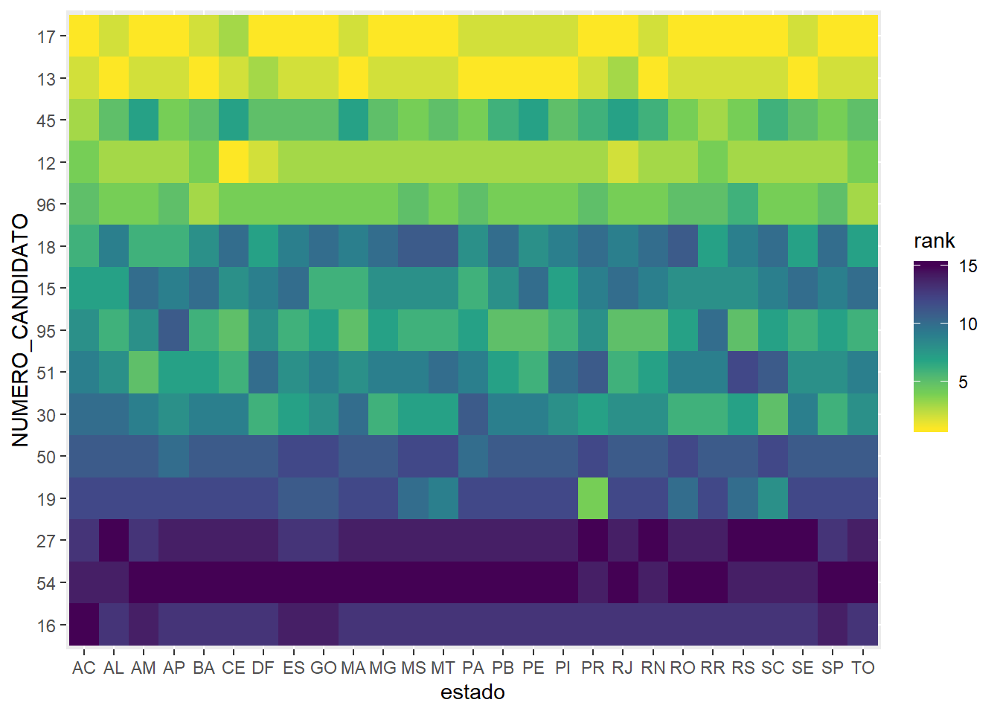

# Tidydata {-}

## Conceito {-}

Se você pegar uma apostila ou livro de 10 anos atrás (e olhe que o R tem 23 anos) vai perceber que as análises tinham muitos mais passos apoiados em vetores (unidimensional) e listas (multidimensional). Com o tempo e principalmente por conta dos pacotes do tidyverse, a análise foi ficando cada vez mais amarrada aos `data.frames`, o que facilita a manipulação e deixa o código mais consistente. Hoje, toda manipulação de dados no R se baseia no conceito tidy data (material para leitura [aqui](https://vita.had.co.nz/papers/tidy-data.pdf) e [aqui](https://garrettgman.github.io/tidying/)) com `data.frames`.

Por tidy data, entendemos que:

*  Variáveis estão dispostas em colunas.
*  Observações estão dispostas em linhas.
*  Os valores atribuídos às variáveis em cada observação formam a tabela.


Para exemplificar o conceito, vamos trabalhar com a base de IDH de municípios do estado de São Paulo.


```r
idh <- read_excel("input/idh_1991_2010.xlsx")

idh
```

Neste dataset, temos uma variável de tempo chamada `decada` e outras variáveis que indicam o fator de desenvolvimento `longevidade`, `educacao`, `renda` para cada município `cod_municipio`.

Se entendermos que cada um desses fatores de desenvolvimento é uma variável independente, está tudo certo perante o conceito do tidy data. Mas se pensarmos bem, esses fatores também podem ser considerados níveis de uma variável `idh`, cuja média dos fatores retorna o IDH que conhecemos. Então, o formato que vamos dar aos nossos dados pode variar dependendo da pergunta que queremos responder.

Um exemplo prático é tentarmos fazer um gráfico dos fatores de desenvolvimento ao longo do tempo para uma cidade específica. O `ggplot2` assume que, se você for gerar uma legenda, ela tem que estar referenciada a uma variável. Nesse caso, temos 3 variáveis para gerar uma legenda, e isso não é legal para o `ggplot2`.


```r
idh %>% 
  filter(cod_municipio == 3501608) %>% # Americana-SP
  ggplot(aes(x = decada)) +
    geom_line(aes(y = longevidade, color = "longevidade")) +
    geom_line(aes(y = educacao, color = "educacao")) +
    geom_line(aes(y = renda, color = "renda"))
```

Tivemos que fazer uma gambiarra porque para este gráfico, os dados precisam estar formatados de outra maneira. Vamos dar um talento nele e refazer o gráfico.


```r
idh_tidy <- gather(idh, fator, idh, longevidade, educacao, renda)

idh_tidy
```


```r
idh_tidy %>% 
  filter(cod_municipio == 3501608) %>% 
  ggplot(aes(x = decada, y = idh, color = fator)) +
    geom_line()
```

De maneira geral, temos que fazer essas manipulações para encaixar os dados no formado que a função foi desenhada para trabalhar. E essa transposição é super fácil com o `gather` e com o `spread`. Um é o oposto do outro. No primeiro caso nós 'tombamos' as colunas para uma única variável. Para retornar ao formato original, é só usar o `spread`.


```r
idh_tidy %>% 
  spread(fator, idh)

idh_tidy %>% 
  spread(decada, idh)
```


```r
idh_tidy %>% 
  ggplot(aes(x = decada, y = idh)) +
    geom_line(aes(group = cod_municipio), alpha = 0.1) +
    facet_wrap(~fator) +
    theme_bw()

idh_tidy %>% 
  ggplot(aes(fator, idh, fill = fator)) +
    geom_violin() +
    facet_wrap(~decada, scales = "free_x") +
    theme_bw()
```

## Exercícios {-}

(@) **Importe o arquivo `base_vespa2.xlsx` e use a função `glimpse()` para ver a estrutura da base.**


```
#> Observations: 140
#> Variables: 17
#> $ Tratamento  <chr> "Actara d1", "Actara d1", "Actara d1", "Actara d1"...
#> $ Individuo   <dbl> 1, 2, 3, 4, 5, 6, 7, 8, 9, 10, 11, 12, 13, 14, 15,...
#> $ `1-Peciolo` <dbl> 1, NA, NA, NA, NA, NA, NA, NA, NA, NA, NA, NA, NA,...
#> $ `1-Nervura` <lgl> NA, NA, NA, NA, NA, NA, NA, NA, NA, NA, NA, NA, NA...
#> $ `1-Caule`   <dbl> NA, NA, NA, NA, NA, NA, NA, NA, NA, NA, NA, NA, NA...
#> $ `2-Peciolo` <dbl> 1, NA, NA, NA, NA, NA, 2, NA, NA, NA, NA, NA, NA, ...
#> $ `2-Nervura` <dbl> 1, NA, NA, NA, NA, NA, NA, NA, NA, NA, NA, NA, NA,...
#> $ `2-Caule`   <dbl> 1, NA, NA, NA, NA, NA, NA, NA, NA, NA, NA, NA, NA,...
#> $ `3-Peciolo` <dbl> 1, NA, 1, NA, NA, NA, 7, NA, NA, NA, 1, NA, NA, NA...
#> $ `3-Nervura` <dbl> 1, NA, NA, NA, NA, NA, NA, NA, NA, NA, NA, NA, NA,...
#> $ `3-Caule`   <dbl> 2, NA, 1, NA, NA, NA, 3, NA, NA, NA, NA, NA, NA, N...
#> $ `4-Peciolo` <dbl> 2, NA, 2, NA, NA, NA, 8, NA, NA, NA, 1, NA, NA, NA...
#> $ `4-Nervura` <dbl> 1, NA, 1, NA, NA, NA, NA, NA, NA, NA, NA, NA, NA, ...
#> $ `4-Caule`   <dbl> 2, NA, 1, NA, NA, NA, 4, NA, NA, NA, NA, NA, NA, N...
#> $ `5-Peciolo` <dbl> 6, NA, 2, NA, NA, NA, 15, NA, NA, NA, 4, NA, NA, N...
#> $ `5-Nervura` <dbl> 3, NA, 1, NA, NA, NA, 10, NA, NA, NA, NA, NA, NA, ...
#> $ `5-Caule`   <dbl> 2, NA, 1, NA, NA, NA, 5, NA, NA, NA, 1, NA, NA, NA...
```
<br>

(@) **Reformule a base de dados seguindo os conceitos do tidy data.**


```
#> # A tibble: 2,100 x 5
#>    Tratamento Individuo Coleta Local   Galhas
#>    <chr>          <dbl> <chr>  <chr>    <dbl>
#>  1 Actara d1          1 1      Peciolo      1
#>  2 Actara d1          2 1      Peciolo     NA
#>  3 Actara d1          3 1      Peciolo     NA
#>  4 Actara d1          4 1      Peciolo     NA
#>  5 Actara d1          5 1      Peciolo     NA
#>  6 Actara d1          6 1      Peciolo     NA
#>  7 Actara d1          7 1      Peciolo     NA
#>  8 Actara d1          8 1      Peciolo     NA
#>  9 Actara d1          9 1      Peciolo     NA
#> 10 Actara d1         10 1      Peciolo     NA
#> # ... with 2,090 more rows
```
<br>

(@) **Importe o arquivo `voto_presidente_2018.csv` e salve em um objeto chamado `voto`. Use a função `glimpse()` para ver a estrutura da base.**


```
#> Observations: 15
#> Variables: 31
#> $ ANO_ELEICAO      <dbl> 2018, 2018, 2018, 2018, 2018, 2018, 2018, 201...
#> $ NUM_TURNO        <dbl> 1, 1, 1, 1, 1, 1, 1, 1, 1, 1, 1, 1, 1, 1, 1
#> $ NUMERO_CANDIDATO <dbl> 12, 13, 15, 16, 17, 18, 19, 27, 30, 45, 50, 5...
#> $ DESCRICAO_CARGO  <chr> "PRESIDENTE", "PRESIDENTE", "PRESIDENTE", "PR...
#> $ AC               <dbl> 21809, 78170, 6458, 80, 262508, 10557, 1531, ...
#> $ AL               <dbl> 155457, 687247, 43895, 744, 528355, 15843, 51...
#> $ AM               <dbl> 138997, 746998, 23420, 835, 805902, 29196, 85...
#> $ AP               <dbl> 50553, 134287, 5611, 560, 166935, 9008, 1435,...
#> $ BA               <dbl> 693273, 4441955, 33109, 2240, 1725140, 61481,...
#> $ CE               <dbl> 1998597, 1616492, 27902, 1563, 1061075, 18071...
#> $ DF               <dbl> 266272, 190508, 26939, 908, 936494, 32115, 11...
#> $ ES               <dbl> 195553, 495868, 22232, 711, 1122131, 26529, 1...
#> $ GO               <dbl> 280864, 713535, 90778, 1011, 1868686, 28783, ...
#> $ MA               <dbl> 282472, 2062638, 52214, 2842, 817531, 23635, ...
#> $ MG               <dbl> 1278819, 3037957, 111999, 6160, 5308047, 9741...
#> $ MS               <dbl> 112296, 333407, 18154, 623, 769116, 12279, 12...
#> $ MT               <dbl> 91344, 404604, 16735, 610, 981119, 12487, 130...
#> $ PA               <dbl> 415593, 1714822, 100724, 2391, 1499294, 53682...
#> $ PB               <dbl> 362775, 984398, 21900, 819, 677718, 12508, 60...
#> $ PE               <dbl> 640860, 2309104, 32088, 2021, 1444685, 46524,...
#> $ PI               <dbl> 211240, 1172147, 16761, 850, 346944, 13313, 5...
#> $ PR               <dbl> 510541, 1210974, 73795, 2246, 3496448, 47335,...
#> $ RJ               <dbl> 1300292, 1255425, 77333, 6005, 5107735, 13079...
#> $ RN               <dbl> 399766, 738165, 11480, 1034, 541448, 10690, 5...
#> $ RO               <dbl> 52118, 176107, 12829, 464, 538311, 7351, 8738...
#> $ RR               <dbl> 14838, 49406, 3426, 146, 174306, 4098, 1472, ...
#> $ RS               <dbl> 724429, 1453291, 124713, 3086, 3353623, 50007...
#> $ SC               <dbl> 264312, 598578, 51670, 1686, 2603665, 25813, ...
#> $ SE               <dbl> 148526, 571234, 8784, 3093, 310310, 15829, 44...
#> $ SP               <dbl> 2650440, 3833982, 267725, 12434, 12378012, 26...
#> $ TO               <dbl> 54262, 311212, 5324, 251, 337782, 7229, 2471,...
```
<br>

(@) **Reformule o objeto `voto` seguindo os conceitos do tidy data. Salve a nova base em um objeto chamado `voto_tidy`.**


```
#> # A tibble: 405 x 6
#>    ANO_ELEICAO NUM_TURNO NUMERO_CANDIDATO DESCRICAO_CARGO estado   voto
#>          <dbl>     <dbl>            <dbl> <chr>           <chr>   <dbl>
#>  1        2018         1               12 PRESIDENTE      AC      21809
#>  2        2018         1               13 PRESIDENTE      AC      78170
#>  3        2018         1               15 PRESIDENTE      AC       6458
#>  4        2018         1               16 PRESIDENTE      AC         80
#>  5        2018         1               17 PRESIDENTE      AC     262508
#>  6        2018         1               18 PRESIDENTE      AC      10557
#>  7        2018         1               19 PRESIDENTE      AC       1531
#>  8        2018         1               27 PRESIDENTE      AC        241
#>  9        2018         1               30 PRESIDENTE      AC       1990
#> 10        2018         1               45 PRESIDENTE      AC      33115
#> # ... with 395 more rows
```
<br>

(@) **Crie uma variável rank para indicar a posição referente ao número de votos apurados de cada candidato dentro de cada estado. Ordene a variável NUMERO_CANDIDATO em função do numero de votos. Faça um heatmap com o resultado do rank.**

Dicas: group_by, row_number, fct_reorder, geom_tile.



