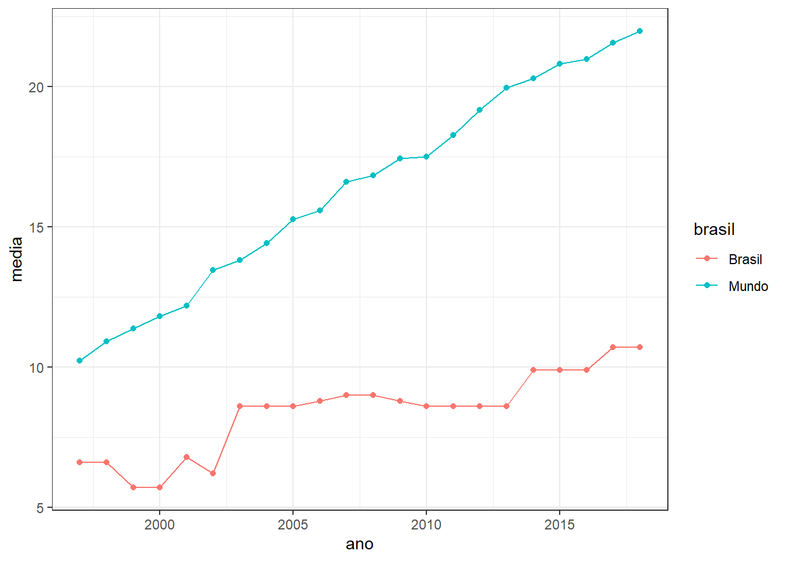

# Iteração {-}

Existe uma máxima muito interessante entre programadores que diz:

> Don’t Repeat Yourself (DRY)

Humanos são extremamente distraídos e cometem muitos erros quando fazer operações repetitivas. Quando estamos programando, não é diferente. As vezes parece mais fácil copiar e colar uma estrutura de código para alterar apenas um detalhe e ter o resultado que se espera. Mas quando o numero de repetições começa a aumentar a chance de fazermos algo errado cresce junto.

No R, esse tipo de problema é resolvido de duas formas: com funções customizadas ou com loops. Nesse modulo vamos falar apenas de loops, mas com certeza ele já vai resolver muitos dos nossos problemas de repetição.

Como exemplo para esse tema, temos um planilha com os dados separados em abas e temos de juntar todos eles para iniciar a análise. Os dados estão na planilha `base_vespa1.xlsx` e em seguida vamos fazer essa junção de 3 formas diferentes.


```r
library(tidyverse)
library(readxl)
library(broom)

aba1 <- read_excel("input/base_vespa1.xlsx", sheet = 1)
aba2 <- read_excel("input/base_vespa1.xlsx", sheet = 2)
aba3 <- read_excel("input/base_vespa1.xlsx", sheet = 3)
aba4 <- read_excel("input/base_vespa1.xlsx", sheet = 4)
aba5 <- read_excel("input/base_vespa1.xlsx", sheet = 5)

base_mobral <- bind_rows(aba1, aba2, aba3, aba4, aba5)

base_mobral
```


```r
base_loop_out <- list()

for (i in 1:5) {
  
  base_loop_out[[i]] <- read_excel("input/base_vespa1.xlsx", sheet = i)
}

base_loop <- bind_rows(base_loop_out)

base_loop
```


```r
base_purrr <- excel_sheets("input/base_vespa1.xlsx") %>% 
  map_df(read_excel, path = "input/base_vespa1.xlsx")

base_purrr
```

Estes 3 métodos exemplificam bastante a relação entre domínio da programação e quantidade de trabalhado apenas pelo computador. No primeiro exemplo tivermos que repetir várias vezes a estrutura do código para poder chegar no resultado esperado. No segundo, já fomos um pouco mais diretos e deixamos o trabalho repetitivo para o computador. Imagina se tivéssemos 30 abas para juntar? E se fossem 500 arquivos? O terceiro exemplo é um passo além de loops e em linguagem de programação chama-se functional programming, onde funções são usadas para realizar as operações que envolvem loops.


## For loop {-}

Loops são bem comuns em linguagem de programação e nos ajudam muito nas tarefas repetitivas. Eles são compostos de 3 partes: 

* O output, estrutura que será populada em cada iteração. Pode ser um vetor, lista ou data frame. 
* Uma sequência, o universo de possibilidades que será executada em cada iteração ou passo. É comum chamarmos de `i`, mas pode ser qualquer denominação e no código é como se fosse um objeto que a cada iteração muda de conteúdo. 
* O corpo, parte que faz o calculo ou operação envolvendo os passos `i` e guardando no `output`.

Retomando o loop que fizemos para ler as abas, temos os 3 componentes bem claros. Vamos rescreve os loop seguindo algumas boas práticas.


```r
arquivo <- "input/base_vespa1.xlsx"

base_loop_out <- vector("list", length = length(excel_sheets(arquivo)))

for (i in seq_along(base_loop_out)) {
  
  base_loop_out[[i]] <- read_excel(arquivo, sheet = i)
}

base_loop <- bind_rows(base_loop_out)

base_loop
```

## Programação funcional {-}

A outra forma de realizar tarefas repetitivas em R é utilizando funções que foram desenhadas para trabalhar com iteração. O pacote do `tidyverse` que reúne estas funções chame-se `purrr`. A ideia das funções do `purrr` é desenhar as iterações sobre vetores, listas ou linhas de um data frame.


```r
map(c(1, 2, 3, 4), rnorm)

map_dbl(mtcars, mean)

map_int(iris, function(x) length(unique(x)))

map_int(iris, ~ length(unique(.)))
```

O pacote tem várias funções e você pode ler sobre elas com mais calma depois. Neste bloco, utilizar a programação funcional para ajustar regressões especificas para um determinado grupo e sempre mantendo tudo amarado a data frames. Esse é uma concepção de programação bastante nova no R, onde coloca o data frame como esqueleto principal da análise e aplicando todas as etapas dentro dele.


```r
inv <- read_excel("input/TUME_134_2016.xlsx")

inv
```

Nosso objetivo é ajustar um modelo hipsométrico (diâmetro-altura) para cada espécie e em seguida predizer as alturas das árvores. O gráfico a seguir mostra a relação que teríamos se fosse ajustado apenas um modelo para todas as espécies.


```r
ggplot(inv, aes(CAP_cm, H_m)) +
  geom_point(alpha=0.4) +
  geom_smooth(method="lm") +
  theme_bw()
```

Mas na prática, a relação diâmetro-altura é diferente entre as espécies, como pode ser notado logo abaixo. Talvez fique mais evidente a diferença observando os coeficientes dos modelos que serão ajustados a seguir.


```r
ggplot(inv, aes(CAP_cm, H_m)) +
  geom_point() +
  geom_smooth(method = "lm") +
  facet_wrap(~Esp)
```

Para entendermos o processo, vamos ajustar a regressão para algumas espécies. O comando `lm()` utiliza a notação em formula para especificar o modelo. Lê-se `H_m` em função de `CAP_cm`, sendo o `~` responsável por determinar as variáveis dependentes e independentes.

O pacote `broom` tem algumas funções que facilitam a extração das informações do modelo ajustado. Iremos utilizar a função `glance` para pegar as estatísticas gerais do modelo e a função `tidy` para acessar os coeficientes e significâncias.


```r
m1 <- lm(H_m ~ CAP_cm, data = filter(inv, Esp == "E_citriodora"))

glance(m1)
```


```r
tidy(m1)
```


```r
m2 <- lm(H_m ~ CAP_cm, data = filter(inv, Esp == "E_maculata"))

glance(m2)
```


```r
tidy(m2)
```

A primeira etapa é entender que um data.frame pode conter vários tipos de elementos, como números, caracteres, listas e também outros data.frames. Para isso utilizaremos a função nest() do pacote tidyr e aninharemos os dados em função das espécies.


```r
inv_nest <- inv %>%
  group_by(Esp) %>%
  nest() 

inv_nest
```

Agora podemos ajustar um modelo de regressão para cada espécie utilizando a função map, do pacote purrr.


```r
dados_modl <- inv_nest %>% 
  mutate(
    ajuste = map(data, ~lm(H_m ~ CAP_cm, data = .)),
    resumo = map(ajuste, glance),
    coef = map(ajuste, tidy),
    resid = map(ajuste, augment)
  )
 
dados_modl
```

Da mesma forma que aninhamos os dados por espécie, podemos retorná-los para o formato original, mas agora mostrando apenas as informações que realmente interessam.


```r
dados_modl %>%
  select(Esp, resumo) %>% 
  unnest(resumo)
```


```r
dados_modl %>%
  select(Esp, coef ) %>% 
  unnest(coef)
```

Após o ajuste do modelo, temos de predizer as alturas. Por fim, temos de volta um `data.frame` com as alturas preditas.


```r
dados_pred <- dados_modl %>% 
  mutate(
    hpred = map2(ajuste, data, predict)
  ) %>%
  select(Esp, data, hpred) %>% 
  unnest(hpred, data)

dados_pred
```

Para visualizar o resultado da regressão, podemos colocar no gráfico a comparação entre valores medidos e preditos.


```r
dados_pred %>% 
  ggplot(aes(CAP_cm)) +
    geom_point(aes(y = H_m), color = "cadetblue") +
    geom_point(aes(y = hpred), color = "red") +
    facet_wrap(~Esp) +
    theme_bw()
```

## Exercícios {-}

(@) **A partir do data frame `gapminder` crie o objeto `gap_nested` com os dados aninhados em função de `continent` e `country`.**

Dica: nest.


```
#> # A tibble: 142 x 3
#>    continent country     data             
#>    <fct>     <fct>       <list>           
#>  1 Asia      Afghanistan <tibble [12 x 4]>
#>  2 Europe    Albania     <tibble [12 x 4]>
#>  3 Africa    Algeria     <tibble [12 x 4]>
#>  4 Africa    Angola      <tibble [12 x 4]>
#>  5 Americas  Argentina   <tibble [12 x 4]>
#>  6 Oceania   Australia   <tibble [12 x 4]>
#>  7 Europe    Austria     <tibble [12 x 4]>
#>  8 Asia      Bahrain     <tibble [12 x 4]>
#>  9 Asia      Bangladesh  <tibble [12 x 4]>
#> 10 Europe    Belgium     <tibble [12 x 4]>
#> # ... with 132 more rows
```
<br>

(@) **Com o objeto `gap_nested` ajuste um modelo linear com a formula `lifeExp ~ year` e calcule as estatísticas do modelos ajustados**

Dica: map, lm, tidy.


```
#> # A tibble: 142 x 5
#>    continent country     data              fit    tidy            
#>    <fct>     <fct>       <list>            <list> <list>          
#>  1 Asia      Afghanistan <tibble [12 x 4]> <lm>   <tibble [2 x 5]>
#>  2 Europe    Albania     <tibble [12 x 4]> <lm>   <tibble [2 x 5]>
#>  3 Africa    Algeria     <tibble [12 x 4]> <lm>   <tibble [2 x 5]>
#>  4 Africa    Angola      <tibble [12 x 4]> <lm>   <tibble [2 x 5]>
#>  5 Americas  Argentina   <tibble [12 x 4]> <lm>   <tibble [2 x 5]>
#>  6 Oceania   Australia   <tibble [12 x 4]> <lm>   <tibble [2 x 5]>
#>  7 Europe    Austria     <tibble [12 x 4]> <lm>   <tibble [2 x 5]>
#>  8 Asia      Bahrain     <tibble [12 x 4]> <lm>   <tibble [2 x 5]>
#>  9 Asia      Bangladesh  <tibble [12 x 4]> <lm>   <tibble [2 x 5]>
#> 10 Europe    Belgium     <tibble [12 x 4]> <lm>   <tibble [2 x 5]>
#> # ... with 132 more rows
```
<br>

(@) **Salve no objeto `gap_coef` o desaninhe os dados.**

Dica: unnest.


```
#> # A tibble: 284 x 7
#>    continent country     term         estimate std.error statistic  p.value
#>    <fct>     <fct>       <chr>           <dbl>     <dbl>     <dbl>    <dbl>
#>  1 Asia      Afghanistan (Intercept)  -508.     40.5        -12.5  1.93e- 7
#>  2 Asia      Afghanistan year            0.275   0.0205      13.5  9.84e- 8
#>  3 Europe    Albania     (Intercept)  -594.     65.7         -9.05 3.94e- 6
#>  4 Europe    Albania     year            0.335   0.0332      10.1  1.46e- 6
#>  5 Africa    Algeria     (Intercept) -1068.     43.8        -24.4  3.07e-10
#>  6 Africa    Algeria     year            0.569   0.0221      25.7  1.81e-10
#>  7 Africa    Angola      (Intercept)  -377.     46.6         -8.08 1.08e- 5
#>  8 Africa    Angola      year            0.209   0.0235       8.90 4.59e- 6
#>  9 Americas  Argentina   (Intercept)  -390.      9.68       -40.3  2.14e-12
#> 10 Americas  Argentina   year            0.232   0.00489     47.4  4.22e-13
#> # ... with 274 more rows
```
<br>

(@) **Faça um gráfico mostrando a variação dos parâmetros ajustados por Continente.**

Dicas: geom_jitter, facet_wrap(...,  scales = "free_y").


<br>

(@) **Importe o arquivo woman.xls e salve num objeto chamado `woman`.**

Dicas: ?read_excel, skip.


```
#> Observations: 264
#> Variables: 63
#> $ `Country Name`   <chr> "Aruba", "Afghanistan", "Angola", "Albania", ...
#> $ `Country Code`   <chr> "ABW", "AFG", "AGO", "ALB", "AND", "ARB", "AR...
#> $ `Indicator Name` <chr> "Proportion of seats held by women in nationa...
#> $ `Indicator Code` <chr> "SG.GEN.PARL.ZS", "SG.GEN.PARL.ZS", "SG.GEN.P...
#> $ `1960`           <lgl> NA, NA, NA, NA, NA, NA, NA, NA, NA, NA, NA, N...
#> $ `1961`           <lgl> NA, NA, NA, NA, NA, NA, NA, NA, NA, NA, NA, N...
#> $ `1962`           <lgl> NA, NA, NA, NA, NA, NA, NA, NA, NA, NA, NA, N...
#> $ `1963`           <lgl> NA, NA, NA, NA, NA, NA, NA, NA, NA, NA, NA, N...
#> $ `1964`           <lgl> NA, NA, NA, NA, NA, NA, NA, NA, NA, NA, NA, N...
#> $ `1965`           <lgl> NA, NA, NA, NA, NA, NA, NA, NA, NA, NA, NA, N...
#> $ `1966`           <lgl> NA, NA, NA, NA, NA, NA, NA, NA, NA, NA, NA, N...
#> $ `1967`           <lgl> NA, NA, NA, NA, NA, NA, NA, NA, NA, NA, NA, N...
#> $ `1968`           <lgl> NA, NA, NA, NA, NA, NA, NA, NA, NA, NA, NA, N...
#> $ `1969`           <lgl> NA, NA, NA, NA, NA, NA, NA, NA, NA, NA, NA, N...
#> $ `1970`           <lgl> NA, NA, NA, NA, NA, NA, NA, NA, NA, NA, NA, N...
#> $ `1971`           <lgl> NA, NA, NA, NA, NA, NA, NA, NA, NA, NA, NA, N...
#> $ `1972`           <lgl> NA, NA, NA, NA, NA, NA, NA, NA, NA, NA, NA, N...
#> $ `1973`           <lgl> NA, NA, NA, NA, NA, NA, NA, NA, NA, NA, NA, N...
#> $ `1974`           <lgl> NA, NA, NA, NA, NA, NA, NA, NA, NA, NA, NA, N...
#> $ `1975`           <lgl> NA, NA, NA, NA, NA, NA, NA, NA, NA, NA, NA, N...
#> $ `1976`           <lgl> NA, NA, NA, NA, NA, NA, NA, NA, NA, NA, NA, N...
#> $ `1977`           <lgl> NA, NA, NA, NA, NA, NA, NA, NA, NA, NA, NA, N...
#> $ `1978`           <lgl> NA, NA, NA, NA, NA, NA, NA, NA, NA, NA, NA, N...
#> $ `1979`           <lgl> NA, NA, NA, NA, NA, NA, NA, NA, NA, NA, NA, N...
#> $ `1980`           <lgl> NA, NA, NA, NA, NA, NA, NA, NA, NA, NA, NA, N...
#> $ `1981`           <lgl> NA, NA, NA, NA, NA, NA, NA, NA, NA, NA, NA, N...
#> $ `1982`           <lgl> NA, NA, NA, NA, NA, NA, NA, NA, NA, NA, NA, N...
#> $ `1983`           <lgl> NA, NA, NA, NA, NA, NA, NA, NA, NA, NA, NA, N...
#> $ `1984`           <lgl> NA, NA, NA, NA, NA, NA, NA, NA, NA, NA, NA, N...
#> $ `1985`           <lgl> NA, NA, NA, NA, NA, NA, NA, NA, NA, NA, NA, N...
#> $ `1986`           <lgl> NA, NA, NA, NA, NA, NA, NA, NA, NA, NA, NA, N...
#> $ `1987`           <lgl> NA, NA, NA, NA, NA, NA, NA, NA, NA, NA, NA, N...
#> $ `1988`           <lgl> NA, NA, NA, NA, NA, NA, NA, NA, NA, NA, NA, N...
#> $ `1989`           <lgl> NA, NA, NA, NA, NA, NA, NA, NA, NA, NA, NA, N...
#> $ `1990`           <dbl> NA, 3.700000, 14.500000, 28.800000, NA, 3.891...
#> $ `1991`           <lgl> NA, NA, NA, NA, NA, NA, NA, NA, NA, NA, NA, N...
#> $ `1992`           <lgl> NA, NA, NA, NA, NA, NA, NA, NA, NA, NA, NA, N...
#> $ `1993`           <lgl> NA, NA, NA, NA, NA, NA, NA, NA, NA, NA, NA, N...
#> $ `1994`           <lgl> NA, NA, NA, NA, NA, NA, NA, NA, NA, NA, NA, N...
#> $ `1995`           <lgl> NA, NA, NA, NA, NA, NA, NA, NA, NA, NA, NA, N...
#> $ `1996`           <lgl> NA, NA, NA, NA, NA, NA, NA, NA, NA, NA, NA, N...
#> $ `1997`           <dbl> NA, NA, 9.500000, NA, 7.100000, 3.757835, 0.0...
#> $ `1998`           <dbl> NA, NA, 15.500000, NA, 7.100000, 3.474235, 0....
#> $ `1999`           <dbl> NA, NA, 15.500000, 5.200000, 7.100000, 3.6234...
#> $ `2000`           <dbl> NA, NA, 15.500000, 5.200000, 7.100000, 3.7681...
#> $ `2001`           <dbl> NA, NA, 15.500000, 5.700000, 14.300000, 4.610...
#> $ `2002`           <dbl> NA, NA, 15.500000, 5.700000, 14.300000, 6.132...
#> $ `2003`           <dbl> NA, NA, 15.500000, 5.700000, 14.300000, 6.043...
#> $ `2004`           <dbl> NA, NA, 15.000000, 6.400000, 14.300000, 6.702...
#> $ `2005`           <dbl> NA, 27.300000, 15.000000, 7.100000, 28.600000...
#> $ `2006`           <dbl> NA, 27.300000, 15.000000, 7.100000, 28.600000...
#> $ `2007`           <dbl> NA, 27.700000, 15.000000, 7.100000, 28.600000...
#> $ `2008`           <dbl> NA, 27.700000, 37.300000, 7.100000, 25.000000...
#> $ `2009`           <dbl> NA, 27.300000, 38.600000, 16.400000, 35.70000...
#> $ `2010`           <dbl> NA, 27.70000, 38.60000, 16.40000, 35.70000, 1...
#> $ `2011`           <dbl> NA, 27.70000, 38.20000, 15.70000, 50.00000, 1...
#> $ `2012`           <dbl> NA, 27.70000, 34.10000, 15.70000, 50.00000, 1...
#> $ `2013`           <dbl> NA, 27.70000, 34.10000, 17.90000, 50.00000, 1...
#> $ `2014`           <dbl> NA, 27.70000, 36.80000, 20.00000, 50.00000, 1...
#> $ `2015`           <dbl> NA, 27.70000, 36.80000, 20.70000, 39.30000, 1...
#> $ `2016`           <dbl> NA, 27.70000, 36.80000, 22.90000, 32.10000, 1...
#> $ `2017`           <dbl> NA, 27.70000, 38.20000, 27.90000, 32.10000, 1...
#> $ `2018`           <dbl> NA, 27.70000, 30.50000, 27.90000, 32.10000, 1...
```
<br>

(@) **Reformate a tabela seguindo os conceitos do tidy data.**


```
#> # A tibble: 15,576 x 6
#>    `Country Name` `Country Code` `Indicator Name` `Indicator Code` ano  
#>    <chr>          <chr>          <chr>            <chr>            <chr>
#>  1 Aruba          ABW            Proportion of s~ SG.GEN.PARL.ZS   1960 
#>  2 Afghanistan    AFG            Proportion of s~ SG.GEN.PARL.ZS   1960 
#>  3 Angola         AGO            Proportion of s~ SG.GEN.PARL.ZS   1960 
#>  4 Albania        ALB            Proportion of s~ SG.GEN.PARL.ZS   1960 
#>  5 Andorra        AND            Proportion of s~ SG.GEN.PARL.ZS   1960 
#>  6 Arab World     ARB            Proportion of s~ SG.GEN.PARL.ZS   1960 
#>  7 United Arab E~ ARE            Proportion of s~ SG.GEN.PARL.ZS   1960 
#>  8 Argentina      ARG            Proportion of s~ SG.GEN.PARL.ZS   1960 
#>  9 Armenia        ARM            Proportion of s~ SG.GEN.PARL.ZS   1960 
#> 10 American Samoa ASM            Proportion of s~ SG.GEN.PARL.ZS   1960 
#> # ... with 15,566 more rows, and 1 more variable: percentual <dbl>
```
<br>

(@) **Em que ano começam os registros dessa base de dados? Neste ano, qual o país com maior percentual de mulheres?**

Dica: as.numeric, !, is.na.


```
#> # A tibble: 1 x 3
#>   `Country Name`   ano percentual
#>   <chr>          <dbl>      <dbl>
#> 1 Sweden          1990       38.4
```
<br>

(@) **Quais os 10 países com maior percentual de mulheres no parlamento em 2018?**

Dica: as.numeric, top_n, arrange.


```
#> # A tibble: 10 x 2
#>    `Country Name` percentual
#>    <chr>               <dbl>
#>  1 Rwanda               61.3
#>  2 Cuba                 53.2
#>  3 Bolivia              53.1
#>  4 Mexico               48.2
#>  5 Grenada              46.7
#>  6 Namibia              46.2
#>  7 Sweden               46.1
#>  8 Nicaragua            45.7
#>  9 Costa Rica           45.6
#> 10 South Africa         42.3
```
<br>

(@) **Faça um gráfico de linha mostrando a evolução do percentual médio de mulheres no mundo desde 1997**


<br>

(@) **Faça o gráfico anterior somente com dados do Brasil**


<br>

(@) **Consegue juntar estes dois gráficos em um só, com duas linhas?**

Dica: ifelse.


